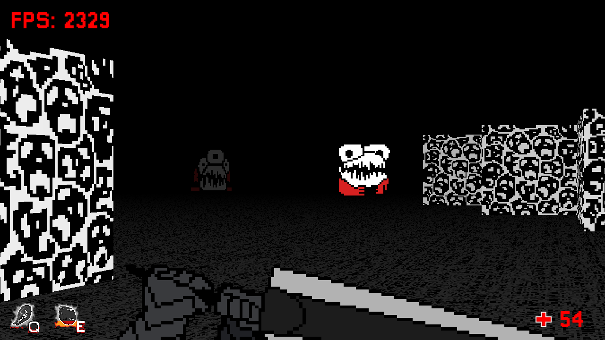
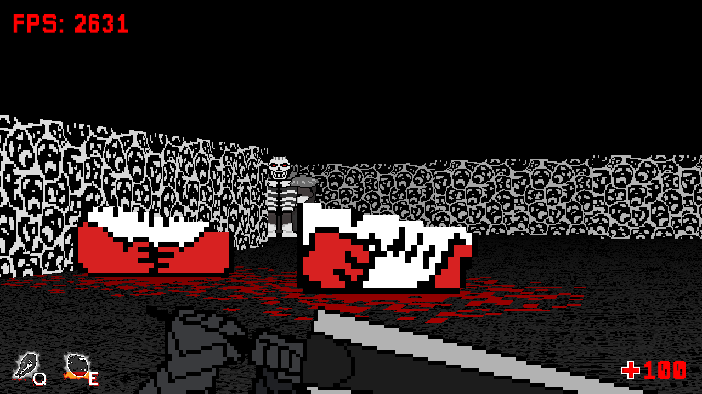

# Rendering features
* Textured walls using ray casting
* DDA algorithm for calculating precise intersection points
* Textured floor
* Custom fog color
* Decals for applying effects onto the floor
* Sprites rendered in a correct order
* High performance by utilizing shaders from SFML

